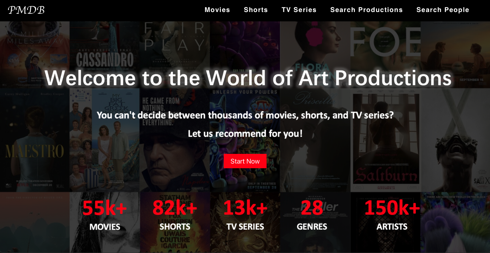
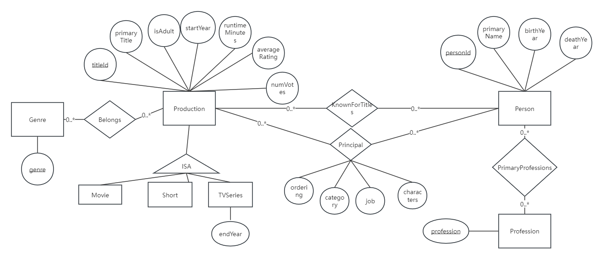

# IMDB full-stack clone - PMDB 🎥🎬✨

[Live Link](https://imdb-full-stack-clone.netlify.app)

Welcome to PMDB, a one-stop destination for all things related to art production in the world of movies, shorts, TV series, and beyond.

Whether you are a filmmaker, a TV enthusiast, or simply an art aficionado, PMDB offers a comprehensive platform for discovering, exploring, and recommending the finest works of art productions.

---

## 🎬 Key Features:

- **Top Productions:** View the top-rated productions for each year and each genre.
- **Detailed Information:** Get comprehensive details about any production or person.
- **Search Functionality:** Search or filter productions or people based on specific criteria.
- **Similar Recommendations:** Receive recommendations for similar productions based on type, genre, year, and crews.

## 🛠️ Project Architecture

### Backend
- **MySQL:** A reliable relational database management system to store and manage data.
- **Node.js:** Server-side runtime to handle API requests and interact with the database.
- **Express:** Web application framework for Node.js to build API endpoints.

### Frontend
- **React:** JavaScript library for building dynamic user interfaces.
- **Material-UI:** React components for faster and easier web development.

## 📊 Database Design

The database design of PMDB is meticulously crafted to handle extensive data related to movie and TV productions, ensuring efficient data retrieval and robust management. Below is an overview of the key tables and their relationships, illustrated by an ER diagram.

### ER Diagram

The database is designed to be in **Third Normal Form (3NF)** and **Boyce-Codd Normal Form (BCNF)** to minimize redundancy and improve data integrity. Here's an overview of the structure:

- **Production:** Contains details about movies, TV series, and shorts, including attributes like `titleId`, `primaryTitle`, `isAdult`, `startYear`, `runtimeMinutes`, `averageRating`, and `numVotes`.
- **Person:** Contains details about individuals involved in productions, including attributes like `personId`, `primaryName`, `birthYear`, and `deathYear`.
- **Genres:** Stores genres associated with productions.
- **Ratings:** Stores rating information for productions.
- **Crew:** Stores information about the crew members involved in productions.

To further normalize the original data tables and achieve BCNF, we decompose tables to eliminate any remaining functional dependencies. For example, we split a table that stores both production and genre information into two separate tables: one for productions and one for genres. This process helps ensure that each table contains data related to a single topic and reduces redundancy.

### Benefits of BCNF:

- **Eliminates Redundancy:** Reducing redundancy helps minimize storage costs and avoids data anomalies.
- **Improves Data Integrity:** By organizing data into well-structured tables, we ensure that the data remains consistent and accurate.
- **Enhances Query Performance:** With optimized tables, queries run more efficiently, improving the overall performance of the database.

By adhering to these normalization principles, PMDB maintains a robust and efficient database structure that minimizes redundancy and ensures data integrity.

## 🚀 Optimization Strategies

Given the large dataset with millions of entries, loading times were initially quite long. To improve performance and reduce loading times, we implemented several optimization strategies:

1. **Creating Views:** To optimize query performance, we created views to store the results of joined tables. Since MySQL does not support materialized views, we created tables in the database to cache the join results. This strategy significantly reduced the time spent on multiple joins, leading to faster data retrieval and improved application performance.

2. **Creating Indexes:** We created indexes on the columns frequently used in the WHERE and ORDER BY conditions of our queries. This indexing strategy helped to speed up search operations and sorting, making the data retrieval process much more efficient.

These strategies have helped boost performance and reduce load time by over 60%, decreasing the load time of some pages from over 15 seconds to under 5 seconds.

## 📘 References and Credits

- **IMDB Datasets:** [IMDB Datasets](https://datasets.imdbws.com/)
- **React:** [React Documentation](https://reactjs.org/)
- **Node.js:** [Node.js Documentation](https://nodejs.org/en/)
- **MySQL:** [MySQL Documentation](https://dev.mysql.com/doc/)

## ✨ Contributors

- 👩‍💻 **Zairui Yang:** [@zairuiy-coding](https://github.com/zairuiy-coding)
- 👩‍💻 **Wen Jiang** [@wenjwj](https://github.com/wenjwj)
- 👨‍💻 **Junwei Yang**  [@Stone-face](https://github.com/Stone-face)
- 👩‍💻 **Yihan Zhu** [@YihanIreneZhu](https://github.com/YihanIreneZhu)

---
Start exploring PMDB today and uncover the best in the world of movies and TV series! 📽️🌟
